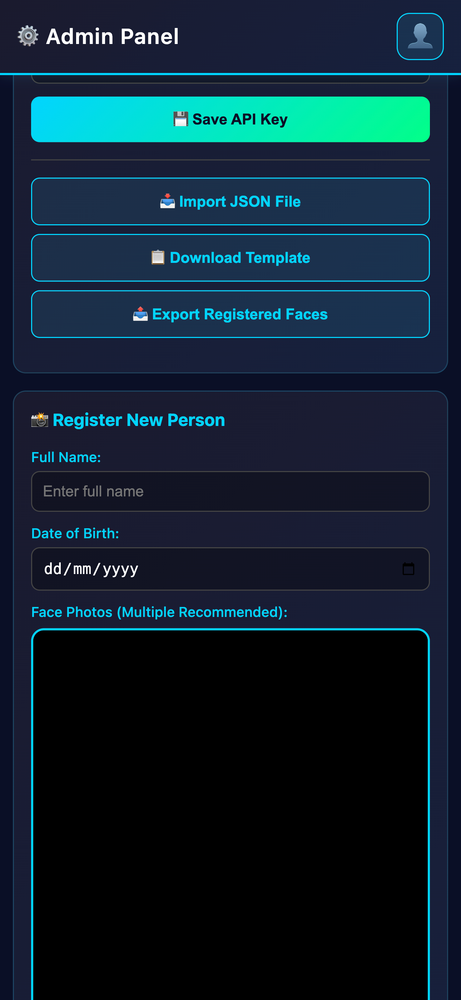
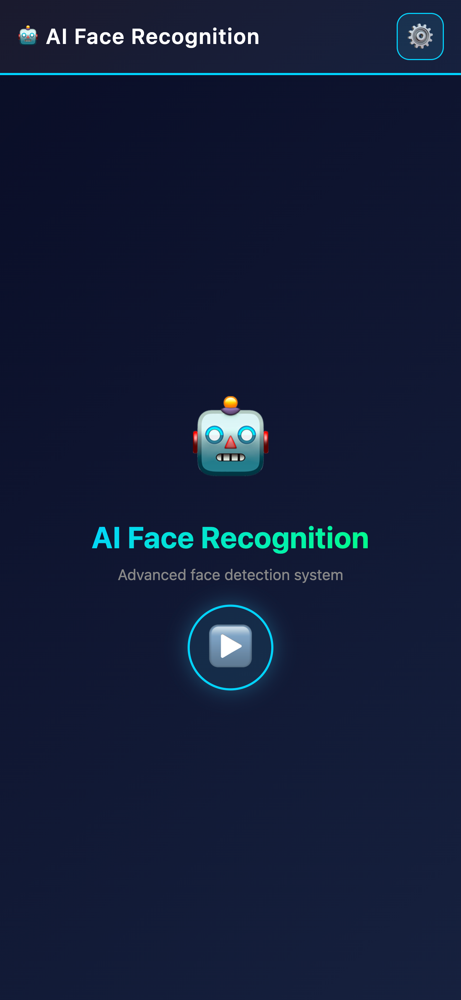

# 🤖 AI Face Recognition

A modern, mobile-first face recognition application with AI-themed UI, real-time detection, and voice synthesis. Perfect for family member identification with advanced facial analysis.

## Screenshot





## ✨ Features

- **🎯 Real-time Face Detection** - Advanced AI-powered face detection using face-api.js
- **👥 Face Recognition** - Identifies registered people in real-time
- **🎨 Mobile-Optimized UI** - Beautiful AI-themed interface designed for portrait orientation
- **📊 Smart Face Visualization** - AI connection lines showing facial landmarks
- **🗣️ Voice Synthesis** - Announces recognized people using Google Cloud Text-to-Speech
- **📱 Responsive Design** - Works on mobile, tablet, and desktop
- **💾 Local Storage** - All face data stored securely in browser's IndexedDB
- **📥 Batch Loading** - Import predefined faces from data.json
- **⚙️ Admin Panel** - Easy management of registered faces

## 🚀 Quick Start

### 1. Install Dependencies

```bash
npm install
```

### 2. Get Google API Key

1. Go to [Google Cloud Console](https://console.cloud.google.com)
2. Create a new project or select an existing one
3. Go to **APIs & Services** → **Credentials**
4. Click **Create Credentials** → **API Key**
5. Copy your API key

### 3. Enable Text-to-Speech API

1. Go to **APIs & Services** → **Enabled APIs & Services**
2. Click **Enable APIs and Services**
3. Search for "Text-to-Speech"
4. Click on **Google Cloud Text-to-Speech API** and click **Enable**

### 4. Run the Application

```bash
npm start
```

The server will start at `http://localhost:3000`

### 5. Configure API Key

1. Open admin panel at `http://localhost:3000/admin.html`
2. Scroll to **🔑 Settings** section
3. Paste your Google API Key
4. Click **💾 Save API Key**

## 📖 Usage

### Main Recognition Interface

1. Open `http://localhost:3000` in your mobile device or desktop browser
2. Click the large **▶️** button to start face recognition
3. Wait for AI models to load (⏳ Loading AI models...)
4. System will display recognized faces in the bottom banner
5. Visit admin panel to register new faces

### Admin Panel

Access at `http://localhost:3000/admin.html`

#### Register Individual Faces
1. Enter person's full name
2. (Optional) Enter date of birth
3. Click **📸 Capture** to capture from camera
4. Click **✅ Register** to save

#### Batch Load from data.json
1. Create `data.json` in root directory (see [Data Format Guide](DATA_FORMAT.md))
2. Click **📥 Load from data.json**
3. System automatically extracts faces and registers them

#### Settings
- Enter and save Google API Key
- Download sample data.json template

## 📊 UI Design Overview

### Main App (index.html)
```
┌─────────────────────────────────┐
│  🤖 AI Face Recognition    ⚙️  │ ← Header with emoji buttons
├─────────────────────────────────┤
│                                 │
│        Live Video Feed          │
│     with AI face lines          │
│                                 │
├─────────────────────────────────┤
│  👤 John (95%)  👤 Jane (88%)   │ ← Single-row banner
└─────────────────────────────────┘
```

### Portrait Mode
- Full video feed (70% of screen)
- Bottom banner with person badges (max 60px height)
- Shows: Name, Confidence %, Age
- Horizontal scrolling for multiple faces

### Admin Panel
- Clean mobile-optimized layout
- Settings section with API key input
- Camera preview for face capture
- List of registered people with photos
- Batch import functionality

## 🎨 Design Features

- **Modern AI Theme**: Cyan/neon colors (#00d4ff, #00ff88) with gradients
- **Smooth Animations**: Floating icons, pulsing indicators, smooth transitions
- **Dark Mode**: Reduced eye strain with dark theme optimized for mobile
- **Emoji Icons**: Intuitive navigation with emoji buttons instead of text
- **AI Visualization**: Connection lines between facial landmarks
- **Responsive Layouts**: Adapts from portrait to landscape mode

## 📁 Project Structure

```
face-recognition/
├── index.html              (Main recognition interface)
├── admin.html              (Admin management panel)
├── face-recognition.js     (Face detection & recognition engine)
├── admin.js                (Admin panel logic)
├── db.js                   (IndexedDB database operations)
├── data.json               (Predefined faces - create manually)
├── package.json            (Node.js dependencies)
├── DATA_FORMAT.md          (data.json format guide)
└── README.md               (This file)
```

## 🔧 Configuration

### Environment Variables

Optional - for running on different ports:

```bash
PORT=3001 npm start
```

### IndexedDB Storage

- **Database Name**: FaceRecognitionDB (v2)
- **Storage Limit**: ~50MB per domain (varies by browser)
- **Practical Limit**: 300-500 people with images

### Face Detection Thresholds

Configure in `face-recognition.js`:

```javascript
const CONFIDENCE_THRESHOLD = 0.75;  // 75% confidence required
const DISTANCE_THRESHOLD = 0.5;      // Maximum distance for match
const SPEAK_COOLDOWN = 5000;          // 5 seconds between announcements
```

## 📥 Batch Loading with data.json

### Format

Create `data.json` in root directory:

```json
{
  "people": [
    {
      "name": "John Doe",
      "dob": "1990-05-15",
      "picture": "https://images.unsplash.com/photo-1507003211169-0a1dd7228f2d?w=400&h=400&fit=crop"
    },
    {
      "name": "Jane Smith",
      "dob": "1992-08-22",
      "picture": "https://images.unsplash.com/photo-1494790108377-be9c29b29330?w=400&h=400&fit=crop"
    }
  ]
}
```

### Image Requirements

- **Size**: Minimum 200×200px, recommended 400×400px square
- **Formats**: JPEG, PNG, WebP
- **Quality**: Clear face visibility, good lighting, straight-on angle
- **Sources**: 
  - Public URLs (Unsplash, Pexels, etc.)
  - Local files (./photos/image.jpg)
  - Base64 encoded data URIs

See [DATA_FORMAT.md](DATA_FORMAT.md) for comprehensive guide.

## 🎯 API Key Setup

### Getting Google API Key

1. **Create Project**
   - Go to [Google Cloud Console](https://console.cloud.google.com)
   - Click "Select a Project" → "New Project"
   - Name it and click "Create"

2. **Create API Key**
   - Go to "Credentials"
   - Click "Create Credentials" → "API Key"
   - Copy the key (store it securely)

3. **Enable Text-to-Speech API**
   - Go to "APIs & Services"
   - Click "Enable APIs and Services"
   - Search for "Text-to-Speech"
   - Enable it

4. **Set Restrictions** (Important for security)
   - Edit your API key
   - Under "API restrictions" select only "Cloud Text-to-Speech API"
   - Under "Application restrictions" select "Referrer (HTTP)"
   - Add your domain (e.g., localhost:3000)

5. **Enter in Admin Panel**
   - Visit admin panel
   - Scroll to "🔑 Settings"
   - Paste your API key
   - Click "💾 Save API Key"

## 🐛 Troubleshooting

### No faces detected
- Ensure good lighting
- Position face directly toward camera
- Avoid extreme angles or shadows
- Check camera permissions in browser

### API Key issues
- **"API Key not found"** → Set key in admin panel settings
- **"Permission denied"** → Verify API key is enabled for Text-to-Speech
- **"Invalid API key"** → Double-check you copied the entire key

### Audio not playing
- Check if Google API Key is configured
- Verify Text-to-Speech API is enabled
- Check browser console (F12) for errors
- Allow autoplay permissions in browser

### Face not recognized
- Ensure clear frontal face photo during registration
- Try different angles and lighting
- Verify face is 200×200px minimum
- Check confidence threshold settings

### data.json loading fails
- Verify file is named exactly `data.json`
- Place in root directory (same level as index.html)
- Validate JSON format (use online JSON validator)
- Ensure image URLs are accessible
- Check browser console for specific errors

### Storage issues
- **"Quota exceeded"** → Delete some people or clear browser storage
- **IndexedDB full** → Storage limit is ~50MB per domain

## 💻 Browser Compatibility

- ✅ Chrome 90+
- ✅ Firefox 88+
- ✅ Safari 14+
- ✅ Edge 90+
- ✅ Mobile browsers (iOS Safari, Chrome Mobile)

### Required Features
- MediaStream API (camera access)
- WebGL (face detection)
- IndexedDB (storage)
- Fetch API
- ES6+ JavaScript

## 🔒 Security & Privacy

- **Local Processing**: All face detection happens in the browser
- **No Server Upload**: Face data never leaves your device
- **IndexedDB Storage**: Data stored only in browser's local storage
- **API Key**: Only used for text-to-speech, stored locally
- **No Tracking**: No analytics or telemetry

## 📱 Mobile Optimization

- Portrait-first design
- Touch-friendly buttons (minimum 44×44px)
- Optimized for small screens
- Efficient battery usage with requestAnimationFrame
- Smooth 60fps animations

## 🎓 Technology Stack

- **Frontend**: HTML5, CSS3, JavaScript (ES6+)
- **Face Detection**: face-api.js v1.7.8
- **Storage**: IndexedDB v1.0
- **Audio**: Web Audio API + Google Cloud Text-to-Speech
- **Backend**: Node.js with Express (optional, for serving files)

## 📚 Additional Resources

- [Data Format Guide](DATA_FORMAT.md) - Complete guide for data.json
- [face-api.js Documentation](https://github.com/vladmandic/face-api)
- [Google Cloud Text-to-Speech](https://cloud.google.com/text-to-speech/docs)
- [IndexedDB Guide](https://developer.mozilla.org/en-US/docs/Web/API/IndexedDB_API)

## 🤝 Contributing

Suggestions for improvements:
- Export registered people as data.json
- Video recording of recognized faces
- Real-time statistics dashboard
- Multi-language support
- Advanced face filters (age, expression detection)

## 📝 License

This project is open source and available under the MIT License.

## 🙏 Acknowledgments

- face-api.js by vladmandic
- Google Cloud APIs
- Unsplash for sample images

---

**Happy face detecting! 🤖👤**
